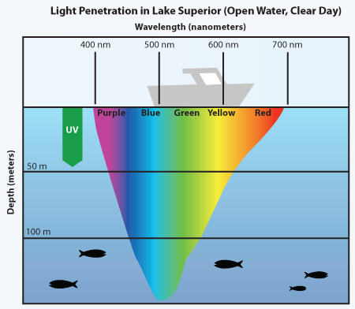

# 1.3 Light & Photosynthesis

## Physics of Light&#x20;

<figure><figcaption>
University of Minnesota Sea Grant -<a href="https://manoa.hawaii.edu/exploringourfluidearth/physical/ocean-depths/light-ocean"> Source</a>
</figcaption></figure>

* Attenuation - reduction in intensity with distance in a medium&#x20;
  * Input wave decreases in wavelength when traveling through any absorbent medium&#x20;
  * at 1m only 45% of solar energy that hits the ocean remains, at 10m its only 16% and at 100m is 1% - [Source](https://rwu.pressbooks.pub/webboceanography/chapter/6-5-light/)
* Light absorption - light is absorbed by colored objects or particles&#x20;
  * detritus, chlorophyl, DOM and water will all absorb light as it passes &#x20;
* Scattering - when light encounters particles smaller than a wavelength&#x20;
  * water & bacteria & suspended particles&#x20;
* Reflection & absorption go hand in hand - we see the colors that are reflected, not the ones that are absorbed (white=all, black=none)&#x20;
* Irradiance - the flux of radiant energy per unit area&#x20;

<figure><figcaption>
Byron Inouye
</figcaption></figure>

## Photosynthesis

#### [Photosynthetically active radiation (PAR)](https://www.fondriest.com/news/photosyntheticradiation.htm)

* PAR - the amount of light available for photosynthesis&#x20;
* 400-700nm wavelength range&#x20;
* PAR changes seasonally and varies depending on latitude and time of day, with levels highest during summer at mid-day&#x20;
* Measuring PAR:&#x20;
  * values range from 0 to 3,000 millimoles per square meter, at night PAR = 0&#x20;
  * measured using a silicon photovoltaic detetor&#x20;
* PAR irradiance - radiant flux density, or the radiative energy recieved by unit surface area in unit time carried by photons on the PAR waveband&#x20;

#### Variables&#x20;

* Kd - vertical attenuation coefficient for downwelling irradiance&#x20;
  * determines the characteristics of the local light environment&#x20;
* Sources - <mark style="color:purple;">Thomas' dissertation</mark>,

#### Photoinhibition&#x20;

* When PAR exceeds the capacity of the light-independent reactions (calvin cycle).&#x20;
* Electrons get transferred to oxygen but energy is not transferred photosynthetically&#x20;
* Excess energy can damage photosystems&#x20;
* Commonly exacerbated by environmental stressors like cold, nutrient limitation, etc.&#x20;

#### Chloroplasts & Chlorophyl&#x20;

* Chloroplast - organelle within plant cells&#x20;
  * Stroma - fluid&#x20;
  * Thylakoid membrane - light reaction & calvin cycle&#x20;
  * chloroplasts are very similar to cyanobacteria - believe that endosymbiosis led to full integration of chloroplasts&#x20;
* Chlorophyl - family of pigments that make plants green, absorb blue and red light, reflect green &#x20;
  * chl a - all photosynthetic organisms have it, enables light energy to be transformed into chemical energy&#x20;
  * chl b - algae and trees, increases light absorption and capacity of chl a&#x20;
  * chl c2 - in some algae, allows chl a to absorb sunlight (reddish-brown in color)
  * chl d - in some cyanobacteria
  * chl f - absorbtion of red light very efficently&#x20;

#### [Photosystems](https://www.youtube.com/watch?v=\_hUxKPSNTl0\&ab\_channel=CNUBiochemistry)

Photosystem 2 - oxidizes water and transfers electrons to photosystem 1&#x20;

* Photon enters photosystem 2 & is absorbed by light harvesting complex, moving it to P680
* P680 absorbs red light at 680nm&#x20;
* electron is taken from water molecule (oxidized)
* Photon excites the electron, moving it up in energy state&#x20;
* Electron transport chain moves electron from photosystem 2 to 1, making ATP&#x20;

Photosystem 1 - generates NADPH, uses phosphorylation to generate ATP

* photon enters photosystem 1, is absorbed by light harvesting complex, moving to P700
* P700 absorbs light at 700nm
* electron from photosystem 2 is excited, reacting to form NADP+&#x20;
* takes in two electron to make NADPH&#x20;
* NADPH & ATP produce a sugar complex, forming a glucose molecule&#x20;

#### [Fluorescence](https://www.youtube.com/watch?v=Bb114gD4Ys0\&ab\_channel=loblolly90)&#x20;

* when photon excites electrons in PSI or PSII:&#x20;
  * 1 photochemistry of energy creation
  * 2 emits heat
  * 3 emits a photon with a longer wavelength (fluorescence)&#x20;
* in fully functional/healthy PSII, the fluorescence is predictable
* increased fluorescence means that less of the photon energy is going into energy creation and more is being fluoresced&#x20;

#### Calvin Cycle (Light independent) - carbon fixation&#x20;

* occurs in Stroma&#x20;
* Phase 1 - C is fixed by Rubisco&#x20;
  * Rubisco - enzyme that fixes inorganic carbon to organic&#x20;
    * if there is too much O2, rubisco will accidentally split O2, creating a toxic byproduct that plants have to deal with&#x20;
* Phase 2 - Reduction
* Phase 3 - Regeneration&#x20;

## Instrumentation

* Radiometers - light meters, measure UV and visible light, describe shape of light field&#x20;
* Satellites - spectral radiometers measure light reflected from the surface layer of the ocean&#x20;
* Pulse amplitude modulated (PAM) -&#x20;
* Silicon photovoltaic detector - measures PAR

## References&#x20;

#### <mark style="color:purple;">Graus & Macintyre 1976</mark>

Created a computer model to simulate macromorphology based on light availability that matched the massive - platylike trend we see in nature.&#x20;
