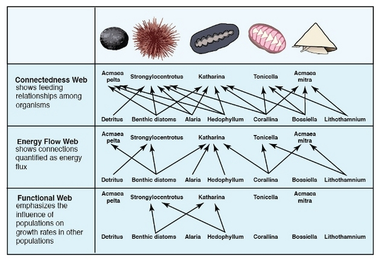
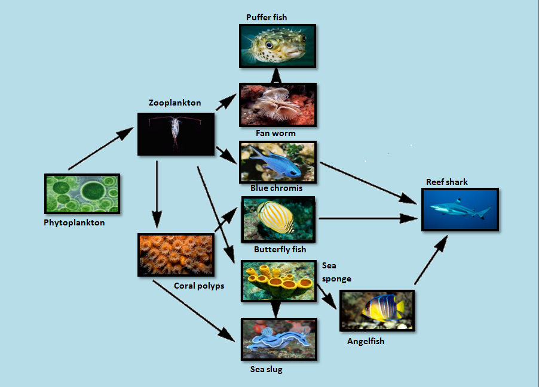

# 2.1a Food Webs

Types of food webs - interactive, functional, energy flow, connectedness

<figure><figcaption></figcaption></figure>

[More advanced types of food web dynamic analyses ](https://www.fisheries.noaa.gov/insight/food-web-dynamics-products-and-analyses)

<figure><figcaption>
Example of a reef food web 
</figcaption></figure>

#### [Corallivores ](https://www.frontiersin.org/articles/10.3389/fmars.2018.00525/full)

* Parrotfish&#x20;
* Bioeroders like mollusks, annelids, flatworms and echinoderms

#### Herbivorous fishes (functional groups based on feeding behavior)

* croppers (e.g., surgeonfish: _Acanthuridae_),&#x20;
* browsers (e.g., chubs: _Kyphosidae_),&#x20;
* scrapers
* excavators (e.g., parrotfish: _Labridae_)&#x20;
* farmers (e.g. damselfish)&#x20;

#### Non-fish Herbivores&#x20;

* Invertebrates - urchins (see above), crabs, limpets, chitons, and polychaete worms
* Vertebrates - Sea turtles, dugongs,&#x20;
