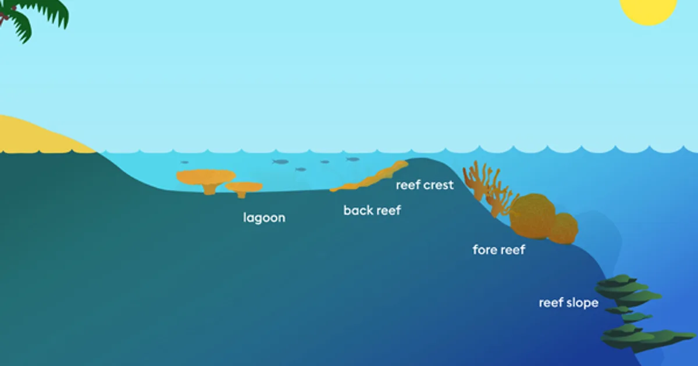

# 2.2 Reef Structure

## Types of Reefs&#x20;

<figure><figcaption>
Also<a href="https://coral.org/en/coral-reefs-101/types-of-coral-reef-formations/"> Patch reefs </a>
</figcaption></figure>

## Global Distribution

#### Mesophotic Reefs

* non-reef forming corals?&#x20;

#### Tropical Reefs&#x20;

1. Below 30˚ latitude around equator&#x20;
2. annual sea-surface temps average at least 20˚C&#x20;
3. eastern margins of continents where shallow shelfs provide suitable habitat
4. thrive on normal-salinity seawater&#x20;
5. usually found within 50 m of the surface in clear waters&#x20;

* tropical regions with warm water and no upwelling needed for CaCO3 deposition&#x20;
* macroalgal competition is high in higher latitudes&#x20;
* Patterns in diversity
  * higher diversity in the indo-pacific (700 species) than Atlantic (175)&#x20;
  * high diversity created by uniform and predictable conditions on tropical reefs promoted fast specialization (contradicts [intermediate disturbance hypothesis](../../3.-ecology-and-evolution/3.2-general-ecology.md))

#### Temperate corals&#x20;

## Zonation

<figure><figcaption></figcaption></figure>

* spurs & buttresses - form from low tide - 20m, dissipate energy from waves&#x20;
* associated with changes in [macromorphology](broken-reference) - branching & complex structures in shallow to massive/platelike structures in deep&#x20;

## Environmental Factors Affecting Structure&#x20;

* Light
* Wave action - large amounts of wave action restructure the reef completely. These are the most common type of disturbance and cause fragmentation and removal of species for new succession to&#x20;
* Sedimentation
* Oxygen&#x20;
* Temperature&#x20;

## Biological Factors Affecting Structure

* Oligotrophic waters - tropical seas are very depleted in dissolved nutrients and therefore plankton. Corals rely on their [symbiosis](broken-reference) to be the primary producers in this ecosystem.&#x20;

