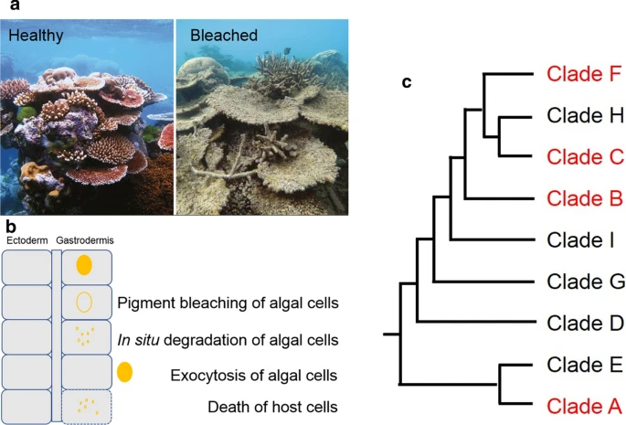

# 2.7 Symbiosis

## Types of symbiosis on reefs&#x20;

### Symbiotic continuum - Parasitism -> Commensalism -> Mutualism&#x20;

#### Commensal&#x20;

* shrimpfish + sea urchins - the fish acquire protection rom urchin without affecting it

#### Mustualistic&#x20;

* clownfish + anemones - fish gain protection from the stinging tentacles, clownfish act as bait to lure other fish in&#x20;
* Remoras + sharks, large fish, and sea turtles - the remora uses a sucking disc to attach to the host, feeding on scraps and cleaning host of external parasites. Remora gets a free ride & protection, host rids itself of parasites&#x20;
* cleaning shrimp or fish species + larger fish - cleaners get food, larger fish get cleaned&#x20;
* Giant Clam + Symbiont - enlarged mantle houses symbionts, which are 'farmed' then transported to the digestive glands where they are digested (only once they are old or not functioning well)
* Coral + cyanobacteria: N-fixing bacteria live in the skeletons of hermatypic corals benefit from C production of the corals&#x20;
* Sponge, jellyfish, coral + symbiont -&#x20;

#### Parasitic&#x20;

* viruses, bacteria, flatworms, roundworms, leeches + fish&#x20;
* pearlfish + sea cucumbers - pearlfish live in the intestinal tract of sea cucumber and eat waste or sometimes healthy tissue&#x20;

## Symbiodiniacea

* unicellular algae that photosynthesize&#x20;
* Pigmentation&#x20;
  * Chlorophyl a&#x20;
  * Chlorophyl c2
* Mutualistic relationship where both benefit
  * corals provide stable protected environment and an abundance of nutrients (CO2, N and P waste from cell resp in coral)
  * symbionts provide photosynthetic products (O2, energy rich organic macromolecules)&#x20;
  * Symbionts produce 10-100 times more C than they need and almost all this excess is transported to the coral&#x20;
* Obligate symbiosis - organisms like octocorals have lost the ability to heterotrophically feed, meaning they rely entirely on symbiosis&#x20;
* Facultative symbiosis - corals can survive with or without symbiosis, and can expel or gather symbionts according to energetic needs&#x20;
* Nutrient recycling within the oligotrophic waters&#x20;

#### Species/ taxonomy

* Phylum: Myzozoa
  * SuperclassL Dinoflagellata
    * Class: Dinophyceae&#x20;
      * Order: Suessiales
        * Family: Symbiodiniaceae&#x20;
* clades A - I&#x20;

<figure><figcaption></figcaption></figure>

<figure><figcaption></figcaption></figure>

<figure><figcaption></figcaption></figure>

## References

#### <mark style="color:purple;">Ferrier-Pages et al. 2018</mark>

Review of isotope methods on marine symbiosis. Talks about the use of N, C, and CSIA with a particular focus on corals. Lots of good diagrams showing energy, nutrient, macromolecule flow.&#x20;

#### <mark style="color:purple;">Baker 2001</mark>

Symbiont communities change after bleaching which may help with long-term survival.&#x20;

#### <mark style="color:purple;">Ferrier-pages 2022</mark>

Tested DIC and DIN assimilation to symbionts in two mesophotic genera, and quantified translocation to the host. They found that mesophotic corals can't rely on autotrophy to meet their metabolic needs and are N limited. This likely causes slowed growth rates. Morphology of the colony likely improves heterotrophic capcaity, represented by changes in assimilation & C:N ratios. These genera are likely limited to a narrow depth range because of their adaptations to survive there, and should be viewed as marginal reefs rather than refugia.&#x20;

#### <mark style="color:purple;">Wall 2020</mark>

d

#### <mark style="color:purple;">Reynaud 2009</mark>

d

#### <mark style="color:purple;">Palardy 2008</mark>

d

