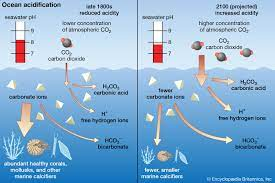

# 2.8 Reef Mortality

#### &#x20;Climate Change & Bleaching&#x20;

* sea level rise, changes in storm frequency and intensity, changed ocean circulation & warming waters
* Bleaching summary
  * symbiont photosystem is easily overwhelmed by excess light leading to the production of reactive oxygen species&#x20;
  * create oxidative stress in the coral tissue, causing coral to expel symbionts to avoid tissue damage&#x20;
  * previous exposure & symbiont species affects bleaching severity&#x20;
* Bleaching causes slowed growth, mortality, reduced reproduction, increased susceptibility to disease&#x20;

#### Sedimentation&#x20;

* sediments can smother coral colonies, clogging feeding structures, blocking sunlight, and causing exhaustion by forcing the animal to clean itself off (using mucus)&#x20;
* caused by deforestation, coastal development, and agriculture&#x20;

#### [Disease](https://floridadep.gov/sites/default/files/Coral-Bleaching-and-Disease-Fact-Sheet.pdf)&#x20;

* black band, white band, white plague etc.&#x20;

#### Deoxygenation

* 1-2% decrease in global dissolved oceanic oxygen. Deoxygenation negatively affects disease, bleaching, reproduction & growth rate.&#x20;
* Sources: <mark style="color:purple;">UN Report 2019</mark>, <mark style="color:purple;">Hughes et al. 2020</mark>, <mark style="color:purple;">Nelson & Alteri 2019, Report- UN 2019,</mark>&#x20;

<figure><figcaption></figcaption></figure>

#### Acidification&#x20;

* Increased CO2 in the atmosphere leads to increased DIC in the ocean, and the consumption of carbonate ions impedes calcification rates, making corals grow more slowly.&#x20;
* Sources: <mark style="color:purple;">Fabricus 2011</mark>, <mark style="color:purple;">Johnson et al. 2017, Wall et al. 2017, Schoepf et al. 2013</mark>

<figure><figcaption></figcaption></figure>

<figure><figcaption></figcaption></figure>

#### [Bioerosion](https://www.marine.usf.edu/reefslab/documents/evol\_ecol2007/Glynn\(inpress\).pdf)&#x20;

* any organism that erodes and weakens the calcareous skeletons of reefbuilding species.
* external - parrot fish, puffer fish, hermit crab, limpet, urchin, chiton&#x20;
* Internal - algae, fungi, bacteria, sponges, bivalves, barnacles, worms&#x20;

#### Reef destruction&#x20;

* harmful fishing practices, development or other physical destruction of reefs&#x20;

#### Algal competition / shifting states&#x20;

* Decline in herbivores - fewer herbivores like urchins allows the shift to algal steady state&#x20;
* Overfishing - removal of herbivorous teleosts enables macroalgal growth&#x20;
  * break down of food web
  * cyanide & dynamite fishing&#x20;
* predators - crown of thorns sea star,&#x20;

#### Pollution&#x20;

* Sunscreen (<mark style="color:purple;">Danovaro et al. 2008</mark>)
* Excess nutrients - runoff from agriculture (fertilizers) and sewage, increasing N and P which peaks algal growth (phytoplankton blooms -> no oxygen, no light)&#x20;
* Plastics - microplastics ingested & smothered/light blocked by macro plastics&#x20;
