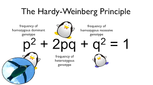

# 3.1 Evolution & Plasticity

## Mechanisms of Evolution

Gene flow - transfer of genetic material from one population to another.&#x20;

* High gene flow will result in the same allele frequencies&#x20;

Genetic Drift - Random removal of individuals that changes allele frequencies&#x20;

* bottleneck effect - random individuals survive but their new ratios change the local population&#x20;
* Founder effect - new organisms that arrive do not always represent former population&#x20;

Mutation - random change in nucleic acid&#x20;

* gene mutations - change in one or more base (substitution/insertion/deletion), may cause different AAs&#x20;
* Chromosomal mutations - duplication, deletion, inversion, translocation of information on chromosomes&#x20;
* If mutation is heritable, it can affect evolution&#x20;

Natural Selection - organisms that are more adapted to their environment are more likely to survive and pass on the genes that aided in their success.&#x20;

## Evolution Definitions

Speciation -  reproductive isolation leads to independent species&#x20;

* Allopatric speciation - geographical barrier that prevents interbreeding. Over time, the populations change causing speciation
* Sympatric speciation - speciation that occurs in the same habitat&#x20;
  * Prezygotic barriers - behavioral isolation, temporal isolation, habitat isolation&#x20;
  * Postzygotic barriers - mating ocurred but offspring is weak, unable to develop, or infertile&#x20;

Species - must be able to reproduce&#x20;

*

Acclimation - when an organism undergoes physiological, morphological or biochemical change within its lifetime, to enhance survival&#x20;

Fitness - reproductive potential&#x20;

Specialization - the adaptation of an organ or part to serve a special function or to suit a particular way of life

### Plasticity

* the adaptability of an organism to changes in its environment or differences between its various habitats&#x20;
* phenotypic plasticity - the property of a genotype to produce different phenotypes in response to different environmental conditions.&#x20;
  * interaction between nature and nurture&#x20;
  * Reaction norms - genotype specific function relates phenotypes produced to the environments they were produced&#x20;
* Adaptive plasticity hypothesis - plasticity may be an adaptive character, affected by  natural selection&#x20;
* Costs of plasticity - (described by DeWitt et al. 1998)
  * maintenance - energetic costs of sensory and regulatory mechanisms
  * production - excess cost of producing structures plastically (compared to those produced through fixed genetics)
  * information acquisition - energy cost of sampling the environment and the loss of that time and effort from another aspect of life (foraging, mating)&#x20;
  * developmental instability - implies reduced canalization of development within each environment
  * genetic - deleterious effects of plastic genes through linkage, pleiotropy, epistasis&#x20;
* ino reliability - environmental cues can be unreliable or rapidly change&#x20;
* lag time - response may start too late&#x20;
* developmental range - plastic genotypes might not be able to express range of phenotypes that is as broad as the range of environmental conditions&#x20;
* epiphenotype problem - plastic response could have evolved recently and may serve as an add-on rather than a fundamental part of the unit&#x20;
*

### Adaptation

* shift in allele frequency in a population over multiple generations&#x20;
* features of organisms shaped by evolution&#x20;
* always tied to natural selection&#x20;
* optimal trait for that environment must be selected for&#x20;
* stabilizing selection - juveniles have a larger variation of traits than adults, suggesting that
* &#x20;conclusions from (<mark style="color:purple;">Evolutionary Ecology</mark>)
  * adaptation is not unifactorial - there is no one metric to measure, nor one null and alternate hypothesis, complicated by gene flow and interactions between effects&#x20;
  * adaptation requires compromise - because of complexity, observed adaptation is a compilation of tradeoffs&#x20;
  * Fitness is context-specific - the fittest organism in one environment may be the least fit in a different one.&#x20;

#### Case studies

Guppies (<mark style="color:purple;">Evolutionary Ecology</mark>)

* 'life history' - composite of variables that contribute to how organisms reproduce&#x20;
  * age at maturity, frequency of reproduction, number and size of offspring, and proportion of resources allocated for reproduction
  * quantitative definition of fitness and predicts how evolutionary changes in life history variables can maximize fitness
  * High predation pools (versus low)&#x20;
    * large mortality of smaller individuals
    * younger age of maturity&#x20;
    * higher rates of investment in reproduction&#x20;
    * shorter wait-times between rounds of reproduction&#x20;
    * devote more resources to reproduction&#x20;
    * produce more offspring per litter, babies are smaller&#x20;

Sailfin Mollies & Least Killifish (<mark style="color:purple;">Evolutionary Ecology</mark>)

* wading bird predation selects against larger individuals
* chronic cold stress in winter selects against slammer individuals
* sexual selection through intermale competition and female choice selects against smaller individuals
* strong covariance of development time and body size causes fertility selection to work against larger body sizes as an indirect effect of selection against larger body sizes as an indirect effect of selection for early maturity in growing spring populations&#x20;

#### Theories & Effects

Hardy-Weinberg Equilibrium

* determines stable-state genotype ratios&#x20;
* No mechanisms of evolution are at play&#x20;
* serves as a baseline for genetics&#x20;

<figure><figcaption></figcaption></figure>

Neutral theory of Molecular evolution&#x20;

* Historical theory of selectionism
  * Detrimental mutation -> negative selection -> mutation not seen
  * Beneficial mutation -> positive selection -> Mutation seen&#x20;
  * Classical school of thought - assume that there is a single predominant most fit gene, and that if a new gene is more beneficial it will be quickly fixed by natural selection&#x20;
  * Balance school of thought - appreciate amount of polymorphism in gene pool, maintained actively by natural selection&#x20;
* when we started doing molecular work, we saw that polymorphism was way more common than expected
* neutral mutation -> no selection (no fitness change) -> mutation may be seen (genetic drift, stochastic)&#x20;

#### Molecular clock

* neutral mutations accumulate at a constant rate over time&#x20;

<figure><figcaption></figcaption></figure>

## References

#### <mark style="color:purple;">Levis, Isdaner & Pfennig 2018</mark>
