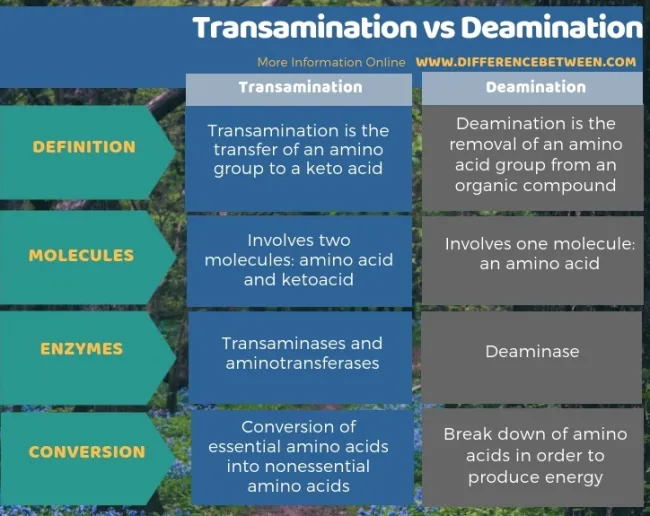

# 4.4b N: Trophic vs. Source

Trophic amino acids&#x20;

* heavily fractionating
* glutamic acid
* commonly undergo transamination&#x20;

Source amino acids&#x20;

* minimally fractionating <mark style="color:red;">- not zero fractionation</mark>
* phenylalanine&#x20;
* commonly undergo hydroxylation&#x20;
* show the baseline&#x20;

<figure><figcaption></figcaption></figure>

Trophic position = trophic - source = Glu - Phe&#x20;

* same source with different trophic means variation in diet&#x20;
* same trophic position/difference between trophic & source means baseline variability&#x20;

TDF

* measured TDF glu-phe values are consistently lower than expected&#x20;
  * **diet quality** - amino acid imbalance with low diet quality leads to more de novo biosynthesis -> increased Glu transamination = higher TDF&#x20;
    * In carnivores: higher protein content = higher excretion rate = higher TDF&#x20;
    * In Herbivores: lower protein content = lower excretion rate = lower TDF&#x20;
  * **Waste type** - ammonia producers have higher TDFs than urea/uric acid producers&#x20;
  * This change can be included in trophic position models by using multiple TDFs as you move up the food chain&#x20;
* Basically the same things as TEF except for the rationale behind the word choice (Kelton prefers TEF)&#x20;

Beta&#x20;

* β = δ15NGlu - δ15NPhe in 1° producers
* vascularization drives beta values (not habitat or mode of photosynthesis)&#x20;
* Phe is the main precursor to many secondary compounds in plants, including lignin&#x20;
* non vascular plants have higher beta value than vascular&#x20;

Microbial N&#x20;

* Microbial N metabolism is highly complex&#x20;
* mixotrophic organisms&#x20;
* Microbes have a very low & highly variable TDF&#x20;

SumV

* degree of microbial working of organic matter&#x20;
