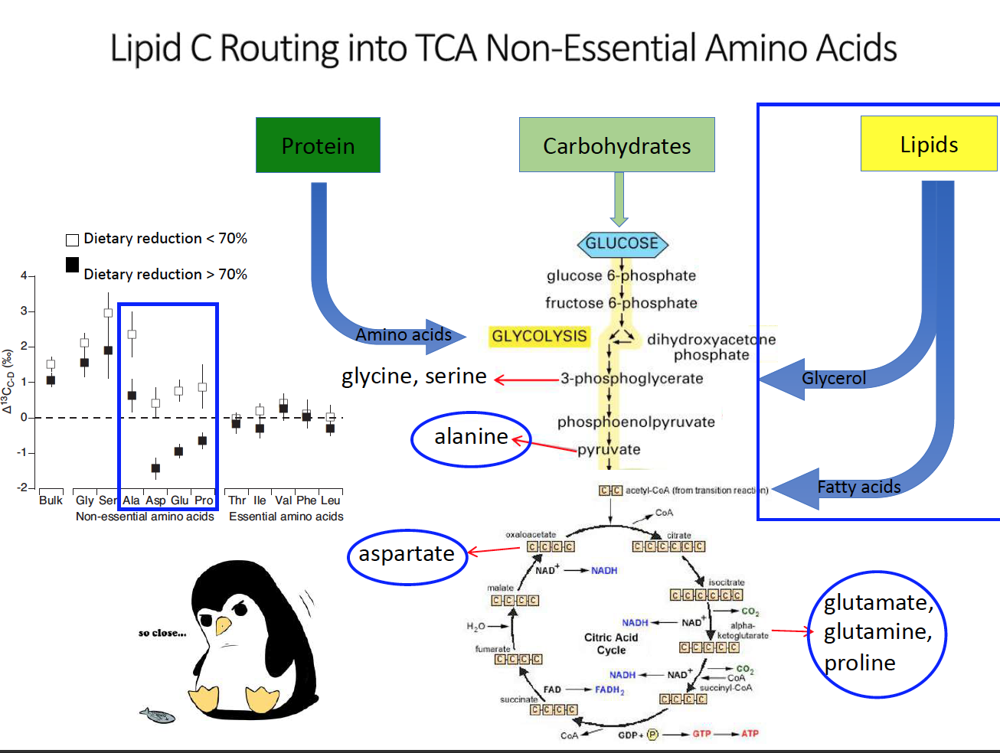
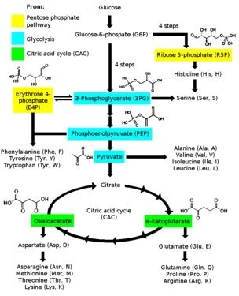

# 4.1a Instrumentation & methodology

## Bulk Stable Isotope Analysis&#x20;

* used for bulk isotope values

1. Entire sample is homogenized & freeze dried
2. Tin capsules containing the sample are fed into an **elemental analyzer**&#x20;
   1. Samples are combusted&#x20;
   2. Gas Chromatography separates heavier from lighter elements&#x20;
3. The flow of gasses is fed into the mass spectrometer where they are pushed around a large magnet, separating&#x20;
4. Results show peaks for each element&#x20;

<figure><figcaption>
Steps: combust sample, filter &#x26; turn into specific gasses, separates gasses by size (molecular weight) and sends each gas through mass spec one at a time
</figcaption></figure>

## Compound Specific Stable Isotope Analysis&#x20;

1. Initial processing (lipid extraction)&#x20;
2. Samples are homogenized & freeze dried & fed into **gas chromatograph combustion**.&#x20;
   1. Gas Chromatography separates compounds&#x20;
   2. Combustion breaks down compounds&#x20;
3. The flow of gasses is fed into the mass spectrometer where they are pushed around a large magnet, separating&#x20;
4. Results show peaks for each compound
5. Repeat steps 3-6 for each element&#x20;

<figure><figcaption>
Chromatography happens before combustion, separating amino acids or fatty acids by molecular weight FIRST, then they are combusted to turn them into N2 or CO2. Resulting peaks will be separated by AA. 
</figcaption></figure>

## Mass Spectrometry&#x20;

* inlet - either used gas chromatography or elemental analyzer to send in a specific flow of gasses in&#x20;
* samples ionized&#x20;
* electromagnet bends the path of the ions, sending them to a specific cup based on which isotopes you're measuring&#x20;
* Ions individually counted
* resluts show peaks for each isotope&#x20;

<figure><figcaption></figcaption></figure>

## Lipid removal&#x20;

* ∆13C decreases with increasing dietary lipid content&#x20;
* Lipids have low δ13C values relative to protein
* Thus variation in tissue δ13C can be driven by variation in % lipid.
* Lipids typically don't have N&#x20;

Lipid extraction:&#x20;

* chemical solvents extract lipids from tissue&#x20;
* can bias δ15N values&#x20;
* Mathematical corrections can also be used in lieu of lipid extraction
*   For lipid-rich tissue or whole animal samples (e.g., liver or small invertebrates), fats must be

    removed prior to hydrolysis, typically with multi-day solvent rinses. Samples can be soaked in a 2:1 mixture of chloroform:methanol for 72 h, with the solvent changed every 24 h. (<mark style="color:purple;">Whiteman et al. 2019</mark>)

Types:

* Fatty acids - Unsaturated & saturated
* Cholesterol
* Wax esters&#x20;

Lipid C routing into NAAs&#x20;

* differential fractionation of the different NAAs because they are created at different points in the metabolic cycle
  * Glycolysis
  * Citric Acid Cycle&#x20;

<figure><figcaption></figcaption></figure>

<figure><figcaption></figcaption></figure>

## Acid Hydrolysis&#x20;

#### <mark style="color:purple;">McMahon et al. 2011</mark>

Briefly, each sample underwent an acid-catalyzed esterification followed by acylation with trifluoroacetic anhydride and dichloromethane under an atmosphere of dinitrogen (N2).

#### <mark style="color:purple;">Whiteman et al. 2019</mark>

Sample preparation for 13C and 15N analysis vary, but 3 general steps apply: (1) the isolation and purification of protein from other organic compounds within a sample (e.g., lipids, carbohydrates), (2) <mark style="background-color:yellow;">the breakdown of the protein structure via hydrolysis to produce free AA</mark>, and (3) the derivatization of free AA to more volatile forms that can be readily separated via gas chromatography (GC), combusted or pyrolyzed to gas, and analyzed in an isotope ratio mass spectrometer (IRMS)
