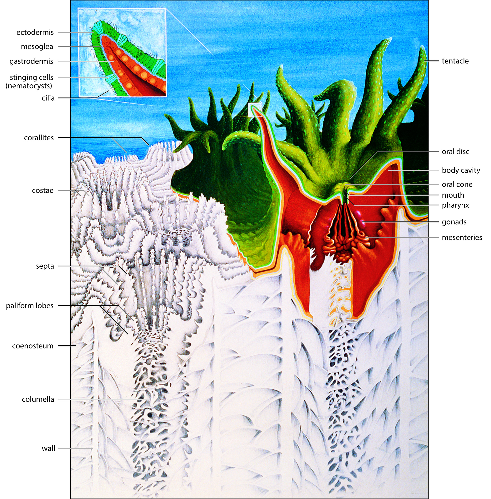

# Basic Coral Biology

## Cnidaria

* Cnidarians have two tissue layers separated by mesoglea, a single hole that functions as the mouth and anus, leading to gastrovascular cavity (incomplete gut)&#x20;
* The mouth is surrounded by tentacles capable of ingesting prey covered with nematocysts, produced by the specialized cells cnidocytes&#x20;
* Medusa or polyp form&#x20;
* Four classes: Hydrozoa (colonial hydroids & siphonophores), Scyphozoa (jellyfish), Anthozoa (corals, sea fans, anemones), Cubozoa (box jellies)&#x20;
* Radial symmetry&#x20;

## Anatomy of Coral&#x20;

<figure><figcaption></figcaption></figure>

Corals consist of three main parts, collectively referred to as the holobiont:&#x20;

1. T**he host coral tissue**; a ring of tentacles surrounding a single opening called the mouth which leads to the stomach.&#x20;
   1. [Mesoglea](https://www.sciencedirect.com/science/article/pii/B9780123850263000097) - The mesoglea is a gelatinous, noncellular connective tissue layer.&#x20;
   2. [Gastrodermis](https://www.sciencedirect.com/science/article/pii/B9780123847195001660): has glandular and phagocytic cells that digest and incorporate the nutrients.&#x20;
   3. [Cenosarc](https://oceanservice.noaa.gov/education/tutorial\_corals/media/supp\_coral01a.html): The coenosarc is a thin band of living tissue that connect individual polyps to one another and help make it a colonial organism.&#x20;
2. **The host coral skeleton**, made of calcium carbonate
   1. See [Morphology](morphology.md) Section&#x20;
3. **The symbiotic organisms** living within the coral tissue&#x20;
   1. See [Symbiosis](../reef-ecology/ecology/symbiosis.md) Section&#x20;

## Basic Taxonomy

* Phylum: Cnidaria
  * Subphylum: Anthozoa&#x20;
    * Class: Hexacorallia (Anthozoans with 6-sided symmetry)&#x20;
      * Order: Scleractinia (Stony Corals)&#x20;
      * Order: Actiniaria (Sea Anemones)&#x20;
    * Class: Octocorallia (Anthozoans with 8-sided symmetry)&#x20;
      * Order: Pennatulacea (Sea pens)
      * Order: Alcyonacea (Soft Corals/Gorgonians)&#x20;
  * Subphylum: Medusozoa (jellyfish & hydra)&#x20;

## General Distribution&#x20;

## Historical Study of Coral Reefs

Sources:&#x20;

1. marine life book&#x20;
