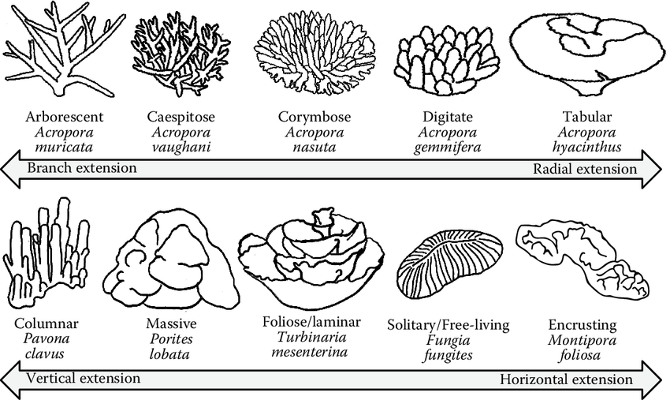

# Morphology

## Macromorpholoy

Macromorphology is here defined as the shape of the entire colony which can express inter- or intraspecific (polymorphic) variation.&#x20;

#### Colony Shapes

.jpg>)

### Variation with depth&#x20;

## Micromorphology&#x20;

### Anatomy of a Calice&#x20;

* corallite/calice -
* Septa - wall-like structures that radiate from the sides of each corallite&#x20;
* Columella - extends upward from the floor of the calice?&#x20;
* Basal plate - partition that provides new elevated bottom in the corallite when coral polyps grow by withdrawing itself upward and secreting a new basal plate
*

### Variation with depth

### Light Interactions
