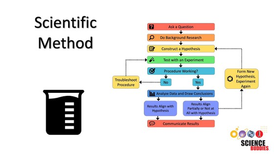

# 5.1 Science & Society

From Graham: "I’d like you to be able to respond to questions about science and how it works, at a level that would be appropriate in a conversation involving non-scientists.  As scientists, we should be ready to contribute a scientific perspective to topics that come up in everyday life."&#x20;

## What is the point of science?&#x20;

#### 1. Science for science's sake

Many scientists, especially traditional/older ones believe that science does not need a purpose. Science should be publicly funded no matter what the subject matter is. New knowledge is always beneficial, so the pursuit of any new scientific discovery is worth pursuing.&#x20;

#### 2. Science to benefit society

Others believe that because science is publicly funded, all science should be directly pursuing something that will benefit society.&#x20;

#### 3. Science as a multi-faceted institution

I believe that any discussion of science should not only include research based on the scientific method, but also the academic and research institutions and the individuals associated with them. No matter how hard we try to avoid bias, science exists within the limitations of social structures that cause bias. The benefit of science includes knowledge for knowledge's sake, research that benefits society, and many academic and social benefits to the individuals who participate in science. This includes the close-knit relationship between science and tertiary education.&#x20;

## Why do scientists never answer questions with certainty? &#x20;

#### Statistical certainty&#x20;

The scientific method requires scientists to make testable hypotheses use methodology and statistical analyses to support or deny them.&#x20;

#### Stochasticity in Nature&#x20;

In nature, there is always some level of stochasticity or randomness. There will always be an exception to any rule. Thus, while environmental scientists pursue comprehension of natural order and assembly of biology, we will never make conclusive statements about nature because there will always be a species or individual that goes against our predictions.&#x20;

#### Science evolves

As new technologies are developed and knowledge is built upon, new discoveries often disprove previously held beliefs.&#x20;

ex. we used to think that symbionts could not take up their own N or P and only got it through their symbiotic relationship with coral.&#x20;

## Is science different from religion? &#x20;

#### Positionality&#x20;

In order to appropriately answer this question, I feel that I should identify my positionally and exposure regarding the topic. I have limited experience with religion, as I was raised agnostic and identify now as an Atheist. Thus, any conclusions I make about religion are based on a limited view of what it means to believe in or practice a religion. I think it is also important to recognize that there may be religions around the world that actually align themselves quite closely with the principles of science. For example, practitioners of Judaism are encouraged to [ask questions](https://www.washingtonpost.com/national/on-faith/to-be-jewish-is-to-ask-questions/2013/03/25/5d4219bc-9548-11e2-bc8a-934ce979aa74\_story.html) and be critical. There are likely many other Indigenous, Eastern, or lesser known religions that I, having been raised in the western world, am not fit to discuss. Thus, rather than answering this question regarding religion as a whole, I will address it concerning my understanding of the tenants of Christianity.&#x20;

| Science                                                | Religion                                  |
| ------------------------------------------------------ | ----------------------------------------- |
| Dependent on observation                               | Dependent on belief                       |
| Testable                                               | Not Testable                              |
| Ever changing, growing body of knowledge, cumulative   | Absolute/unchanging                       |
| How the world works                                    | Why the world works                       |
| Doubt & question                                       | Don't doubt & question                    |
| Empirical                                              | Supernatural                              |
| Objective                                              | Subjective                                |
| open knowledge - falsification is the norm             | Closed knowledge - not open to challenge  |
| Evolution                                              | Creation                                  |
|                                                        |                                           |

#### Similarities

* Builds an understanding of how the world works&#x20;
* Helps us understand our place in the world&#x20;
* Presence of invisible forces
* Both have serious institutional & social flaws that have been built by years of bigotry and exclusion  &#x20;
* Bias- while science likes to boast that it is founded on reducing or eliminating bias, the truth is that there is still tons&#x20;

## Is astrology a science?&#x20;

#### Scientific method

<figure><figcaption></figcaption></figure>

#### What is astrology?&#x20;

Astrology is a method of predicting mundane events based upon the assumption that the celestial bodies—particularly the planets and the stars considered in their arbitrary combinations or configurations (called constellations)—in some way either determine or indicate changes in the sublunar world.  [Read more](https://www.britannica.com/topic/astrology)&#x20;

#### Not science

* is not based on testable ideas
* Testable ideas that have been investigated have not been supported by the scientific method.&#x20;
* does not rely on evidence
* relies on support from members of the field (peer review)&#x20;
* does not lead to future work, and does not stop when ideas have been unsupported&#x20;

## <mark style="color:red;">Is abortion murder?</mark>&#x20;

#### What is abortion?

* Abortion is when a pregnancy is ended so that it doesn't result in the birth of a child. Sometimes it is called 'termination of pregnancy'.
* listed as an essential healthcare service by WHO
* Unsafe abortion methods is a leading cause of maternal deaths&#x20;

#### What are the current limits to abortion?&#x20;

* [Laws by state ](https://reproductiverights.org/maps/abortion-laws-by-state/?state=MA)
* Medical abortion - first 12 weeks
* Surgical abortion - 24 weeks after last menstrual period in many states&#x20;
* Roe vs.  wade
  * Pre-viability gestational bans: Laws that prohibit abortion before viability; these laws were unconstitutional under _Roe_. Gestational age is counted in weeks either from the last menstrual cycle (LMP) or from fertilization.

#### Society & abortion&#x20;

* Abortion as a right for bodily autonomy&#x20;
* Psychological & traumatic effects regardless of positionality&#x20;
* Religion & abortion&#x20;
* Rape & abortion&#x20;
  * in this case, the pregnancy often holds a great deal of trauma&#x20;
  * the pregnant individual does not have bodily autonomy&#x20;

## Are humans really causing the climate to change? &#x20;

[What is climate](https://education.nationalgeographic.org/resource/all-about-climate/)?&#x20;

* long term pattern of weather in a particular area usually tracked for at least 30 years.&#x20;
* climates are often defined by regions of the world - for example, a wet tropical climate, or a polar climate, or a desert climate.&#x20;
* Climates are influenced by the atmosphere, hydrosphere, cryosphere, land surface, and biosphere&#x20;
* The atmosphere, made up of the gasses surrounding the earth,  naturally varies very quickly
* Changes in the hydrosphere & cryosphere change much slower&#x20;

How is it changing? ([NASA](https://climate.nasa.gov/evidence/))

* Global temperature is rising&#x20;
  * 2˚F increase in global temperature since the late 1800s
  * 7 most recent years are the warmest&#x20;
* Warming Ocean waters
  * ocean absorbs much of this heat top 100m of water warmed 0.67˚F since 1969
* Glaciers and snow cover decrease&#x20;
* Sea level rise&#x20;
* ocean acidification
* extreme events increasing frequency &#x20;

Why is it changing?&#x20;

* What we notice is that almost all of these changes have happened in the last 200 years, since the industrial revolution, before that, they were all pretty stable.&#x20;
* the greenhouse effect is a naturally occuring phenomenon that insulates the earth to allow us all to live, but excess CO2 causes it to over-insulate, like if you had too many blankets on.&#x20;
* Keeling Curve&#x20;

What impacts does this have?&#x20;

* increased temperatures affect the survival of most animals and plants on earth - that includes charismatic megafauna, food and crops&#x20;
* [sixth mass extinction ](https://www.worldwildlife.org/stories/what-is-the-sixth-mass-extinction-and-what-can-we-do-about-it)
* [Impacts on Agriculture](https://www.epa.gov/climateimpacts/climate-change-impacts-agriculture-and-food-supply)
* [Impacts on human health](https://www.epa.gov/climateimpacts/climate-change-and-human-health)&#x20;

## Are GMO crops a hazard to human health? &#x20;

* GM Insulin is widely accepted, so why not GM food?&#x20;
* Pro-GM source: [youtube](https://www.youtube.com/watch?v=7TmcXYp8xu4\&ab\_channel=Kurzgesagt%E2%80%93InaNutshell),  [Sci Show](https://www.youtube.com/watch?v=sH4bi60alZU\&t=475s\&ab\_channel=SciShow),&#x20;
* Transgenesis or transgenic organisms have genes from a different species&#x20;
* GMO fight is closely entwined with social & economic debates about the agricultural industry's power and control&#x20;
* considering the number of people on the planet who are starving, we have an obligation to do as much as we can for them.&#x20;

#### What does it mean to be natural?&#x20;

* humans have genetically modified plants and animals for centuries by using selective breeding&#x20;
* selective breeding is modifying gene frequencies over time, which is the same thing that GM does.&#x20;
* selective breeding 'hopes for a lucky hit' while GM choses the traits we want&#x20;

#### Risks

* Gene flow - GM crops could mix with organic crops and introduce unwanted characteristics&#x20;
  * Terminator seeds - sterile plants (would make farmers have to buy new seeds every year - very inequitable) would solve the gene flow issue&#x20;
  * If GM crops and natural ones can mix and produce sterile offspring, then aren't they kinda the same?&#x20;
* Risks associated with eating GM plants - no evidence
* Engineering plants to be toxic - insects are killed by eating GMOs with genes that are pesticides&#x20;

#### Benefits&#x20;

* Reduce use of herbicides & pesticides
* Plants vaccinated against disease&#x20;
* higher yield &#x20;
* improve diet&#x20;
* climate change resilience&#x20;

## Should we vaccinate our children against diseases like polio and measles and diptheria?&#x20;

#### How do vaccines work?&#x20;

* vaccines train our bodies to detect and attack pathogens&#x20;
* immune system needs to recognize antigens on a pathogen&#x20;
* immune system creates  antibodies that team up with immune cells called phagocytes to destroy pathogens, OR they detect and kill already infected body cells&#x20;
* immune system creates memory cells that are prepared to fight off a pathogen if it comes back&#x20;
* vaccines safely introduce antigens for your immune system to train on&#x20;
* live attenuated vaccines
  * introduce weakened versions of a disease that is not enough to give someone the disease but gives the body something to train on - trigger a similar immune response as a real one&#x20;
  * lifetime of immunity after a few doses&#x20;
* subunit vaccine&#x20;
  * only contain part of the pathogen&#x20;
  * ex. HPV vaccines use hollow versions - no live pathogens, and cannot replicate themselves&#x20;
  * also contain ingredients to trigger immune system&#x20;
  * not as effective&#x20;
* Herd immunity&#x20;
  * when a large percent of a community is vaccinated, chains of infection break down, inherently protecting individuals who are not able to develop immunity&#x20;
  * without new hosts, the pathogens can't survive&#x20;
  * if vaccination rates drop, herd immunity is lost and pathogens can reappear&#x20;
  * ex. measles was eradicated in US in 2000 but more people are unvaccinated and it has resurfaced&#x20;
  * ex. smallpox is considered extinct thanks to vaccination & herd immunity&#x20;
