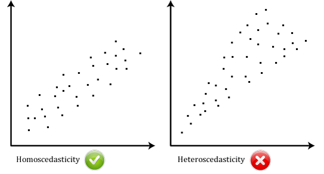
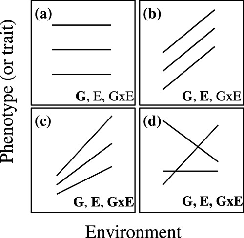

# 5.2 Stats

## Basic Stats Concepts 

#### Sample Independence 

* Independent vs. dependent/paired samples - are your sample groups related to each other? 
  * ex. separate groups of people arriving and leaving an airport is independent, the same individuals as they leave and return would be dependent 
  * dependent samples are always in pairs (or multiples) 
* Different hypothesis test
  * t-test for independent samples or ANOVA without repeated measurements
  * t-test for dependent samples or ANVOA with repeated measurement 
  * datatab.net 

#### [Fixed Effects & Random Effects](https://www.youtube.com/watch?v=3\_sbitgMeUg\&ab\_channel=Meta-Analysis)

* avoid pseudo-replication - most models assume that all results are fixed, but there are random effects everywhere 
* if every measurement comes from a different level of the random effect then each observation is statistically independent & you avoid pseudo-replication 
* Ex. Smokers vs non-smokers 
  * fixed effect - researcher sets/choses levels
  * random effects - introducing other variables that align with the desired levels (for example, one nurse measures all the smokers and another measures all the non-smokers) or multiple replicates of the same individual get measured, you cant treat all the measurements as random 
* fixed effect models - 
  * when all data in analysis are estimated the same in value - same population and protocol 
  * if you look at test scores from sub-pops from one school, all their averages will be the same as the total average 
  * usually not asking about the mean because the mean will be the same for all 
  * models impacted by sample size - larger studies will be weighted heavier 
  * generally not appropriate for most studies 
* random effects models - 
  * start with a universe of populations and sample randomly within that universe 
  * if you add a level and measure from many schools, the average may be the same, but the average for reach individual school will vary 
  * random implies our assumption that the populations we're studying are at random 
  * usually helping to understand the variation between pops 
  * usually more sources of error - higher confidence interval 
  * model not impacted as much by size - larger studies are weighted a little bit heavier, but because they are not all estimating the same mean, its not as much as fixed
* researchers often use heterogeneity tests to determine wether to use random or fixed effect models - but instead it needs to be based on the actual study design 
* What happens if you use the wrong type of model? 
  * the effect size will be wrong 
  * confidence interval is wrong (too narrow) 
  * p-value not valid 
  * analysis will be wrong 

#### [Linear Mixed effects models](https://www.youtube.com/watch?v=QCqF-2E86r0\&ab\_channel=MatthewE.Clapham)

* Simple Linear regression or multiple linear regressions
  * work best when observations are coming from a single homogenous group 
* Linear mixed effects models
  * when there are subgroups that may be affecting the results 

<figure><figcaption></figcaption></figure>

* ex. influence of nitrate (fiexed) on dissolved oxygen in multiple river basins (random)&#x20;
* ex. influence of three light level treatments (fixed) on photosynthetic rate in multiple species (random) with each individual plant (random) measured once per light level&#x20;

Options for dealing with mixed effects:&#x20;

* random effects have different intercepts but the same slope&#x20;
  * in R: y \~ x + (1|group)
* correlating varying slope and intercept&#x20;
  * in R: y \~ x + (x|group)
  * usually best to fit the full structure (use this model)&#x20;

Nested Factors&#x20;

* with multiple random effects nested within each other, where factors only occur within one level&#x20;
  * in R: y \~ color + (color|green/gray) where gray is nested within green&#x20;

<figure><figcaption></figcaption></figure>

Crossed random effects&#x20;

* all combinations of random effects levels occur together
  * in R: y \~ color + (color|green) + (color|gray)

How to check the model (model diagnostics)

1. plot residuals vs. fitted for entire model, and residuals vs. each independent variable should show no trends, be normally distributed with equal variance&#x20;
2. residuals vs. fitted values with each random-effect group should also be normal with equal variance within and between groups&#x20;
3. conditional means of random effects - means of slope values - should be normally distributed - can use a Q-Q plot&#x20;
4. random effects should have many levels (>5 often said to be needed)&#x20;
5. variables that are strongly collinear (have a strong correlation) can cause problems&#x20;
6. structure of random effects should be specified correctly, requires good understanding of data & study design&#x20;

Centering and standardizing models&#x20;

* centering - subtract mean from each data point &#x20;
* standardizing - divide each point by standard deviation&#x20;
* helps model converge (especially with large values)&#x20;
* can help compare magnitude of effect among variables measured with different units/scales&#x20;

Interpreting results of a linear mixed model fit&#x20;

* provides info about model specification and fit, residual variance explained by grouping factor & residuals
* provides intercept, coefficients, standard errors, expected correlation of fixed effects under multiple trials&#x20;
* no p values!&#x20;

#### [Interaction Terms](https://www.youtube.com/watch?v=UVny7a8AoA4\&ab\_channel=DiagKNOWsticsLearning)

* No interaction terms -
  * force the differences between gender to have the same slope&#x20;
  * score =  b1 + b2\*hours + b3\*gender
* With interaction terms -&#x20;
  * allow for more complexity, different intercepts & different slopes&#x20;
  * score = b1 + b2\*hours + b3\*gender + b4\*gender\*hours&#x20;

#### Homoscedasticity&#x20;

* variance of errors is constant&#x20;
* heteroscedasticity - errors change in magnitude as x changes
  * means that there is some important information in the model that is missed, the model could have a better fit &#x20;

## My Statistical Analyses&#x20;

#### [Testing for normality](https://towardsdatascience.com/6-ways-to-test-for-a-normal-distribution-which-one-to-use-9dcf47d8fa93)&#x20;

* &#x20;Shapiro-wilks test
  * shapiro.test(mydata$Detatchment.Force..g.) #p=.2685&#x20;
  * If P>0.05, then the data is normal
* Histogram

<figure><figcaption></figcaption></figure>

* Q-Q plot&#x20;

<figure><figcaption></figcaption></figure>

#### Testing for Homogeneity of variance / homoscedasticity&#x20;

* &#x20;[Bartlett Test ](https://link.springer.com/referenceworkentry/10.1007/978-3-642-04898-2\_132)- Homogeneity of variance test
* bartlett.test(Detatchment.Force..g.\~Condition, data=mydata) #p=.6505&#x20;
* If P>0.05, then variances are equal ##box plots can serve as a good visual for this&#x20;

#### Removing outliers

* z-score: a statistical measurement of a score's relationship to the mean in a group of scores
  * z\_scores <- (data-mean(data))/sd(data)
  * z-score greater than 3 is dropped&#x20;

### Ch1&#x20;

"Each species will be analyzed using a three-way ANOVA (Species (7) x Depth (4) x Site(2)) to test for interactions between species and depth."&#x20;

#### 3-way ANOVA

* Tests all the following models, produces a p-value for each&#x20;
  * Site
  * Depth
  * Species
  * Site\*Species
  * Site\*Depth
  * Depth\*Species&#x20;
  * Site\*Species\*Depth&#x20;

### Ch2

"The difference of the same-genotype pairs (one from a control cage and one from a treatment cage) will be calculated and used for all statistical analyses. Genotype will be treated as an unreplicated block and each of the three sets of genotypes will be analyzed using an ANOVA to compare treatments. Because this analysis only considers samples that survived transplantation, a Fisher’s Exact Test will be used to assess survivorship."

#### ANOVA with unreplicated block

* The cages are unreplicated - they may have caused variation unrelated to the treatment, but because we don't have replicates, we won't know if any of the cages had effects. We can't separate cage effects from treatment effects
* Genotype is also unreplicated - we only have one replicate of each genotype, so each genotype is technically treated as a block&#x20;
* ANOVA - Analysis of Variance&#x20;
  * used on non-binary groups
  * similar to a regression but uses a categorical variable to predict a quantitative one (instead of two quantitative)&#x20;
  * f-statistic - compares how much variation the model accounts for vs. how much it can't account for&#x20;
    * just tells you if SOMETHING is statistically different
    * followed up with multiple t-tests to get p-values  &#x20;

#### [Fisher's Exact Test](https://link.springer.com/referenceworkentry/10.1007/978-3-642-04898-2\_253)&#x20;

* 2 x 2 - 2 conditions, 2 outcomes&#x20;
* calculates the probability of observed data&#x20;

#### [Reaction Norms](https://www.oxfordbibliographies.com/display/document/obo-9780199941728/obo-9780199941728-0130.xml)

* the range of phenotypes expressed by a genotype along an environmental gradient
* closely related to phenotypic plasticity&#x20;
* consists of offset or intercept which describes the mean in each environment, the slope, and the shape or curvature (linear, quadratic, etc.)&#x20;

### Ch3

"3-way ANOVA models (morph x treatment x tray) will be created using a planned-comparisons test (emmeans R package) focused on comparing the shaded and deep treatments with the control. PCA plots will be used to visualize the strength of treatment, Apo or Sym categorization, and caging effects."

#### Planned-comparisons test

* focus on scientifically relevant comparisons rather than all comparisons
* opposite of post-hoc tests&#x20;

#### [Principle component analysis](https://builtin.com/data-science/step-step-explanation-principal-component-analysis)

* dimensionality reduction method&#x20;
* 1- standardization&#x20;
* 2- covariance matrix computation
* 3- compute values from the matrix to determine PCs&#x20;
* [resource 2](https://towardsdatascience.com/a-one-stop-shop-for-principal-component-analysis-5582fb7e0a9c)&#x20;

#### [SIBER Analysis](https://cran.r-project.org/web/packages/SIBER/vignettes/Introduction-to-SIBER.html)

* compares isotopic niche widths
* isotope scatterplots w/ ellipses - standard is 40%&#x20;
* Bayseian analysis&#x20;
* SEA - Standard ellipse area&#x20;

#### [Bayesian Mixing Model (MIXSAIR)](https://brianstock.github.io/mixingmodels/)&#x20;

* statistical tools that use biotracers to estimate contributions of sources to a mixture&#x20;
  * sources = prey, mixture = consumer

<figure><figcaption></figcaption></figure>

